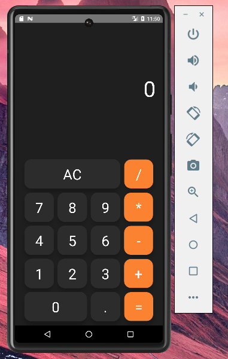
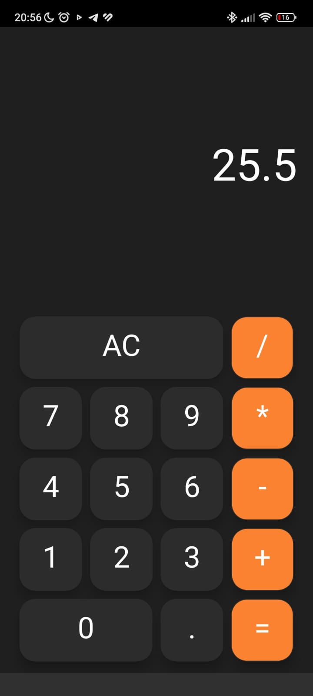

# CALCULADORA React Native

Bem-vindo ao projeto Calculadora React Native! Este projeto foi desenvolvido com o objetivo de praticar React Native, TypeScript e lógica de programação. Além disso, oferece a oportunidade de trabalhar com o Android Studio e aprender a configurar o ambiente de desenvolvimento.




## Começando

> **Nota**: Certifique-se de ter concluído as instruções de [Configuração de Ambiente do React Native](https://reactnative.dev/docs/environment-setup) até o passo "Iniciar aplicação" antes de prosseguir.

### Passo 1: Instalação dos pacotes de dependências

```bash
# usando npm
npm i

# OU usando Yarn
yarn i
```

### Passo 2: Inicie o Servidor Metro

Primeiro, você precisará iniciar o **Metro**, o _bundler_ JavaScript que acompanha o React Native.

Para iniciar o Metro, execute o seguinte comando a partir da _raiz_ do seu projeto React Native:

```bash
# usando npm
npm start

# OU usando Yarn
yarn start
```

### Passo 3: Inicie sua Aplicação

Deixe o Metro Bundler rodar em seu próprio terminal. Abra um novo terminal a partir da raiz do seu projeto React Native. Execute o seguinte comando para iniciar seu aplicativo Android ou iOS:

Para Android

```bash
# usando npm
npm run android

# OU usando Yarn
yarn android

```

Para construir o Android

```bash

$ cd android

# Criar apk de depuração:
./gradlew assembleDebug

# Criar versão de lançamento:
$ ./gradlew assembleRelease #O `apk` gerado estará localizado em `android/app/build/outputs/apk`


```

Para IOS

```bash
# usando npm
npm run ios

# OU usando Yarn
yarn ios
```

### Uso

Agora que o aplicativo está em execução, você pode usá-lo como uma calculadora padrão. Toque nos botões numéricos e de operação para inserir números e realizar cálculos matemáticos.

### Próximos Passos

Você concluiu com sucesso a configuração e execução deste aplicativo React Native! Aqui estão alguns próximos passos que você pode considerar:

- Adicione funcionalidades adicionais à calculadora, como operações matemáticas mais avançadas.
- Personalize a aparência do aplicativo para torná-lo exclusivo.
- Explore mais recursos do React Native para expandir sua experiência de desenvolvimento.

### Solução de Problemas

Se encontrar algum problema ou dificuldade ao configurar ou executar o projeto, verifique a página de [Solucionando Problemas do React Native](https://reactnative.dev/docs/troubleshooting) para obter ajuda.

### Saiba Mais

Para aprender mais sobre o React Native, explore os seguintes recursos:

- [Site do React Native](https://reactnative.dev/) - Saiba mais sobre o React Native.
- [Primeiros Passos](https://reactnative.dev/docs/environment-setup) - Uma visão geral do React Native e como configurar seu ambiente.
- [Aprenda os Conceitos Básicos](https://reactnative.dev/docs/getting-started) - Um passeio guiado pelos conceitos básicos do React Native.
- [Blog](https://reactnative.dev/blog)- Leia as últimas postagens oficiais no blog do React Native.
- [@facebook/react-native](https://github.com/facebook/react-native) - Repositório GitHub de código aberto do React Native.
